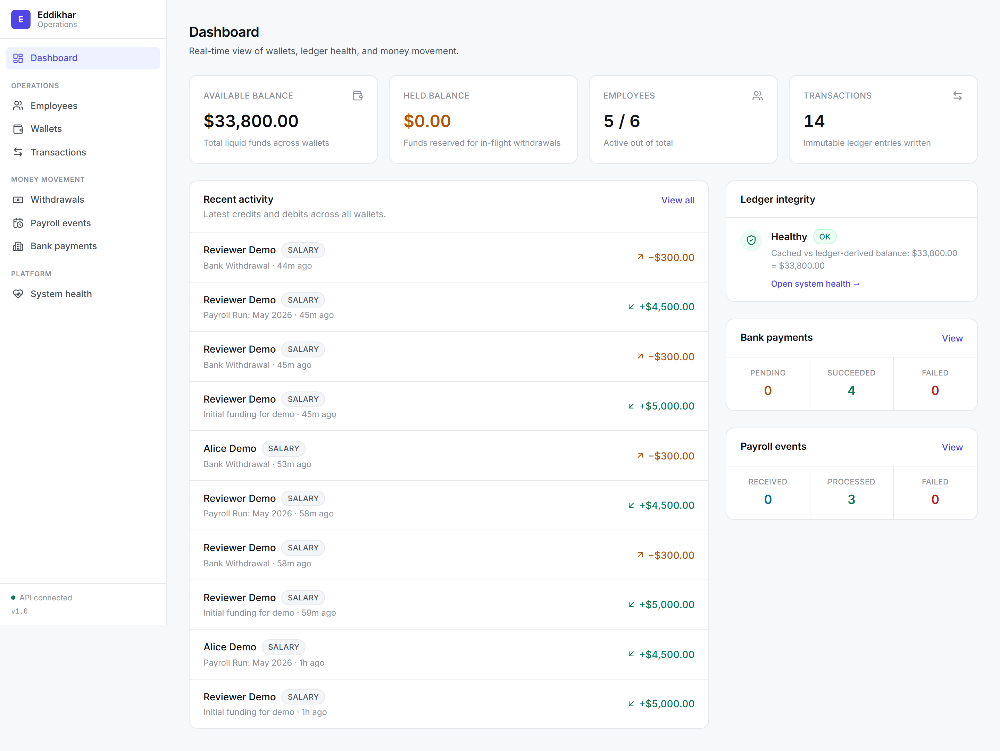
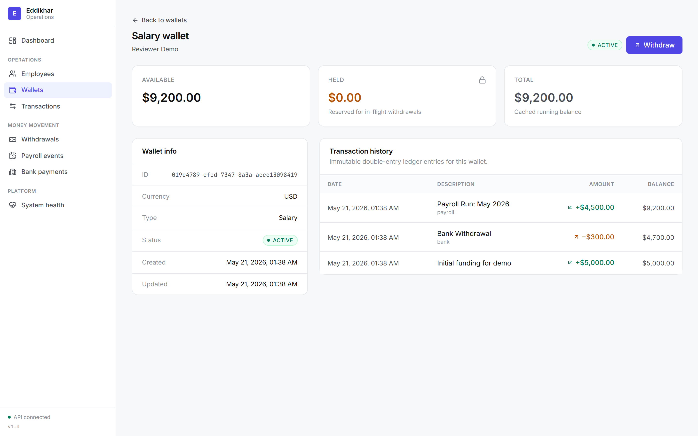
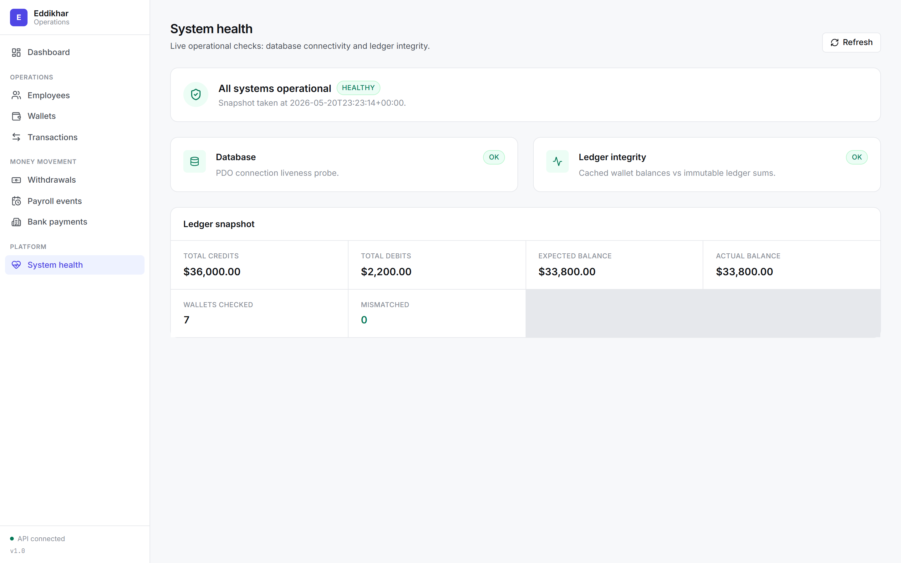
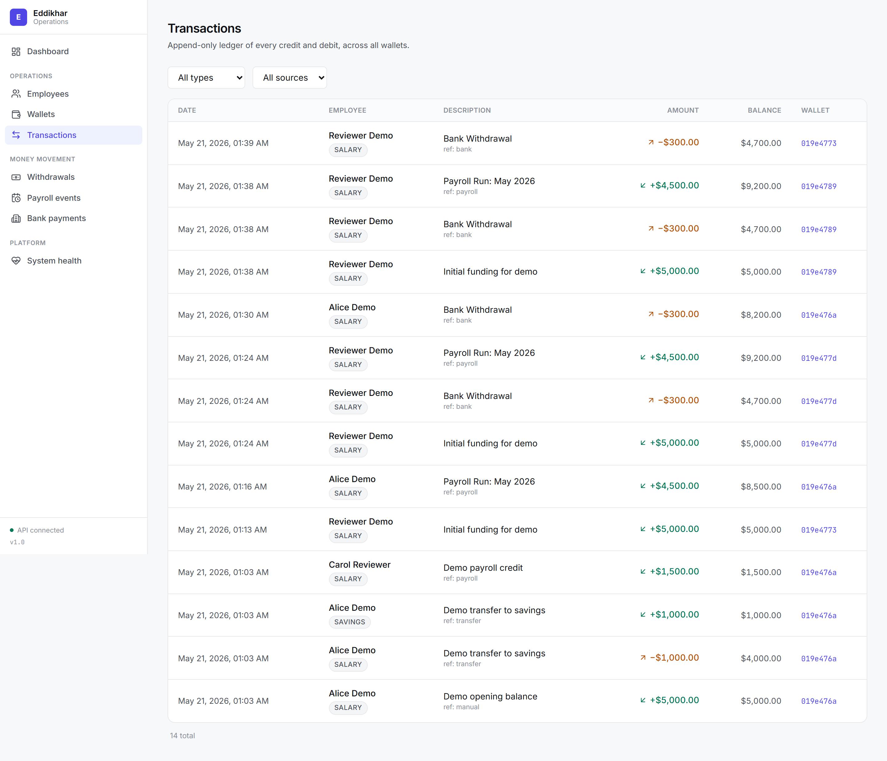
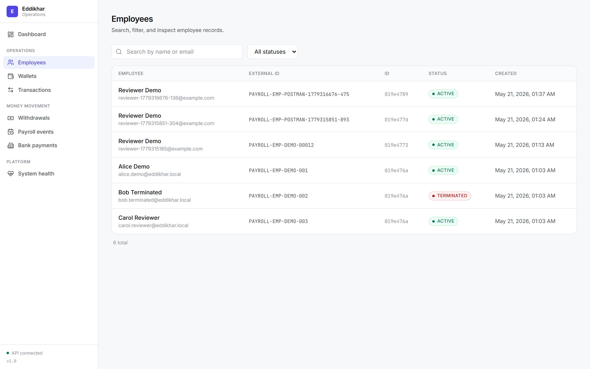
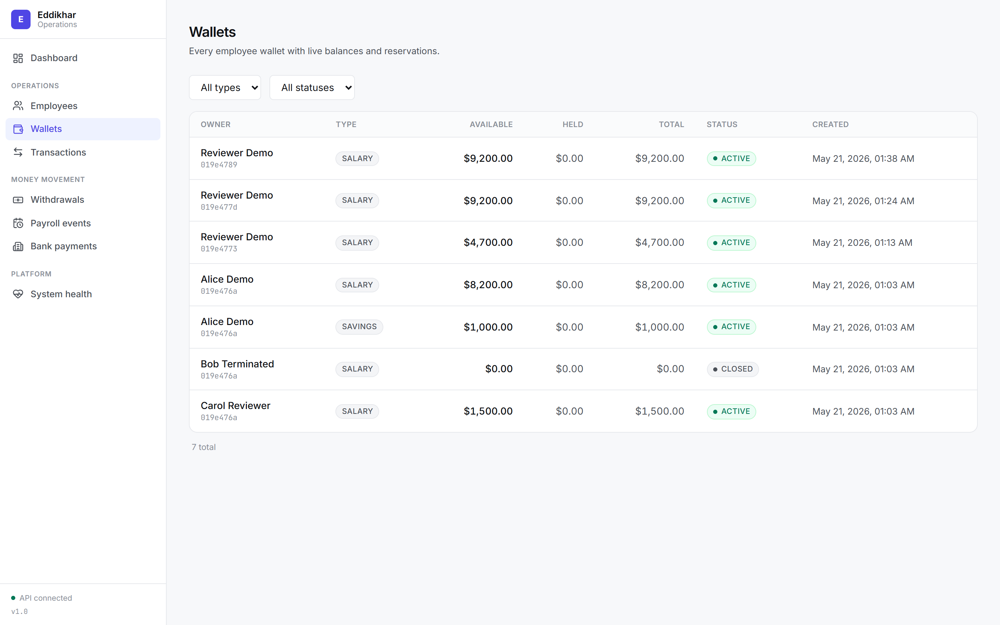
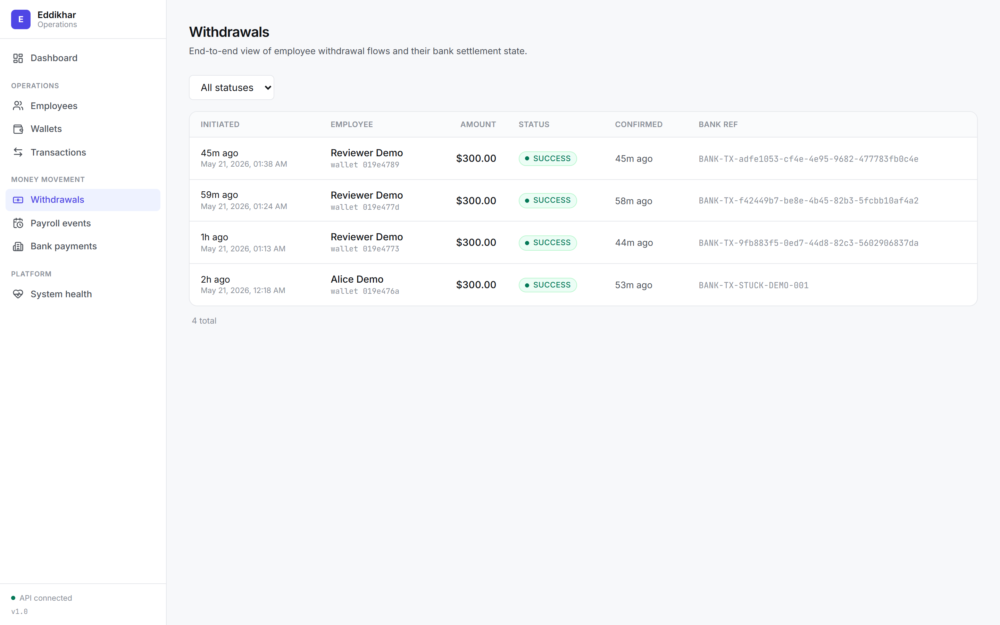
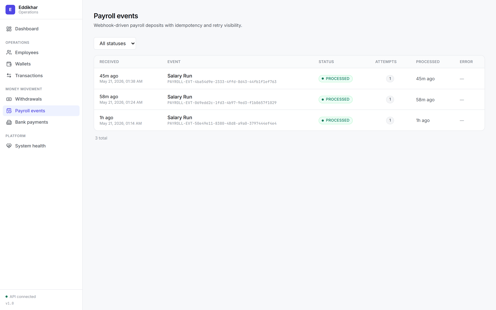
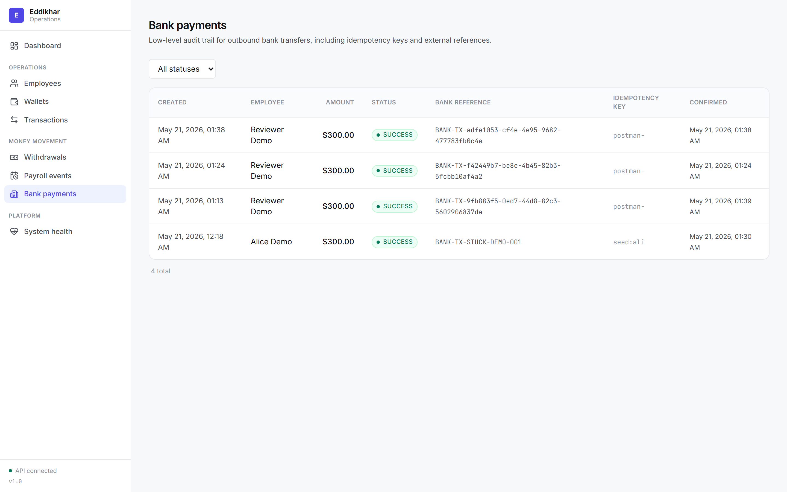

# Employee Wallet & Financial Ledger System

A production-grade, highly consistent, and idempotent FinTech Ledger & Employee Wallet system built with **Laravel 13**, **MySQL**, and **PHP 8.3+**. 

This system represents a core banking and financial ledger engine, strictly designed to solve the challenges of concurrency control, strong consistency, retry-safe idempotency, auditability, and resilient distributed integrations.



---

## 🏗️ Architectural Overview

The system sits between an external simulated HR/Payroll provider, a bank payment gateway partner, and internal systems that require read-heavy access.

```
┌──────────────────┐      ┌────────────────────────┐      ┌──────────────────┐
│ Payroll Provider │ ───▶ │      Our Service       │ ───▶ │   Bank Partner   │
│ (HR Webhooks)    │      │                        │      │ (Payment Gateway)│
│                  │      │  ┌──────────────────┐  │      │                  │
│  - Onboarding    │      │  │    API Layer     │  │      │  - Outbound Pay  │
│  - status changes│      │  └────────┬─────────┘  │      │  - Async Callback│
│  - Salary runs   │      │  ┌────────▼─────────┐  │      └────────┬─────────┘
└──────────────────┘      │  │  Service Layer   │  │               │
                          │  │ (Business Logic) │  │◀──────────────┘
                          │  └────────┬─────────┘  │   Async Webhook Call
                          │  ┌────────▼─────────┐  │
                          │  │  Ledger Engine   │  │
                          │  │  (Double-Entry)  │  │
                          │  └────────┬─────────┘  │
                          │  ┌────────▼─────────┐  │
                          │  │   MySQL InnoDB   │  │
                          │  │ (Row-level Lock) │  │
                          │  └──────────────────┘  │
                          └────────────────────────┘
```

---

## 💎 Core Architectural Decisions

### 1. The Append-Only Double-Entry Ledger
* **The Problem**: Overwriting balances directly on a wallet record creates "ghost state"—leaving no auditable history or proof of how a balance changed.
* **The Solution**: All financial mutations (credits, debits, transfers) must go through the append-only `ledger_entries` table. The ledger is the absolute source of truth.
* **Cached Balances**: For read-heavy dashboard and API queries, the `wallets.balance` column acts as a highly optimized cache of the ledger state. No balance mutation is allowed outside the ledger flow, and any mismatch between the cached balance and the sum of ledger entries is flagged instantly by system health checks.

### 2. The Ban on Floats
* **The Problem**: Floating-point numbers are stored using binary approximations, leading to representation errors (e.g., `0.1 + 0.2 = 0.300000000004`). In financial ledger systems, even a single-cent discrepancy is catastrophic.
* **The Solution**: All monetary values are strictly represented using **`BIGINT` in minor units (cents)**. 
  * `$100.00` is stored as `10000`
  * `$1.50` is stored as `150`
  * Maximum capacity for a 64-bit signed integer is over `$92 trillion`, completely immune to rounding errors.

### 3. Concurrency Control & Deadlock Prevention
* **The Problem**: In high-concurrency systems (e.g., automated salary runs or rapid microtransactions), multiple processes might try to read and write a wallet balance simultaneously, risking double-spending.
* **The Solution**: 
  * **Pessimistic Locking**: Every mutation locks the wallet row in the database using `SELECT ... FOR UPDATE` before executing validations or checks. This forces concurrent modifications to queue up sequentially.
  * **Strict Lock Ordering**: When transferring money between two wallets, acquiring locks in different orders (Transaction 1 locks A then B, while Transaction 2 locks B then A) causes database deadlocks. The system resolves this by **sorting the wallet UUIDs alphabetically and acquiring locks in strict ascending order**, mathematically eliminating deadlock scenarios.

### 4. End-to-End Idempotency & Race Condition Prevention
* **The Problem**: Network drops or client retries can result in the same request (e.g., credit $100) being processed twice. Checking for existence before a transaction creates a Time-of-Check-Time-of-Use (TOCTOU) race condition.
* **The Solution**:
  * Every transaction requires a unique client-provided `idempotency_key`.
  * The system uses an **insert-first strategy inside the database transaction**, under a pessimistic wallet lock.
  * We catch `QueryException` for unique constraint violations across MySQL, PostgreSQL, and SQLite, safely returning the existing transaction without executing new credits/debits. This eliminates race conditions entirely.

### 5. Strict State Machines & Financial Constraints
* **State Machines**: `BankPayment` and `PayrollEvent` utilize rigorous state machines (e.g., `initiated` → `pending` → `success`/`failed`). Transitions are validated at the model level via `updating` hooks and custom exceptions (`InvalidStateTransitionException`), preventing illegal state jumps.
* **Database CHECK Constraints**: Financial invariants are enforced at the database layer (MySQL/PostgreSQL `CHECK` constraints, SQLite triggers). These guarantee `balance >= 0`, `held_balance >= 0`, `held_balance <= balance`, and positive entry amounts, acting as the ultimate safety net.
* **Immutability Hardening**: Custom Eloquent builders (`ImmutableBuilder`) prevent mass updates and deletes that would normally bypass model-level events.

### 6. Cross-Currency (FX) — Current Scope and Future Approach
* **Today**: Wallet transfers require identical `currency` on both wallets. A mismatch throws `DomainException` in `LedgerService::transfer()` — no silent conversion.
* **If FX were required in production**:
  1. Store authoritative rates in an `fx_rates` table (`from_currency`, `to_currency`, `rate`, `effective_at`) with a unique constraint per pair and timestamp.
  2. At transfer time, lock the rate row and compute destination amount in minor units using integer math (never floats).
  3. Record a single `ledger_transaction` with three append-only entries: debit source wallet (source currency), credit an internal FX clearing wallet, credit destination wallet (destination currency). The clearing wallet absorbs rounding residue explicitly.
  4. Reject transfers when no rate exists for the requested window — fail closed rather than guess.

---

## 🔄 Business Flows & Integrations

### Simulated Partner Integrations

Neither partner is a real third-party account. Both are stubs you drive locally or via Postman.

#### Payroll provider (inbound, push webhook)
1. Send `POST /api/payroll/webhook` with body:
   ```json
   {
     "event_id": "unique-external-id",
     "event_type": "employee_onboarded | employee_status_changed | salary_run",
     "payload": { }
   }
   ```
2. The API persists a `payroll_events` row (`status: received`) and dispatches `ProcessPayrollEvent` on the queue (`afterCommit` so the row exists before the job runs).
3. Duplicate `event_id` values return `202 Accepted` with `"Event already received"` — safe to retry from the provider.
4. Supported payloads:
   * **employee_onboarded**: `employee_id`, `first_name`, `last_name`, `email` — creates employee + USD salary wallet if missing.
   * **employee_status_changed**: `employee_id`, `status` — e.g. `terminated` (blocked if any wallet has non-zero balance or held funds).
   * **salary_run**: `employee_id`, `amount` (cents), `currency`, optional `salary_period` — credits salary wallet idempotently.

Ensure `php artisan queue:work` is running so events move from `received` to `processed`.

#### Bank partner (outbound withdrawal + async callback)
1. **Withdraw**: `POST /api/wallets/{wallet_id}/withdraw` with `amount` (cents) and `idempotency_key`. Funds move from available balance into `held_balance`; payment status is `initiated`.
2. **Send to bank**: `SendBankPayment` job calls `BankSimulator::sendPayment()`, which returns a synthetic `external_reference` (`BANK-TX-{uuid}`) and sets status to `pending`.
3. **Complete manually** (simulates the bank calling back later): `POST /api/bank/callback`:
   ```json
   {
     "external_reference": "BANK-TX-...",
     "status": "success",
     "reason": "optional on failure"
   }
   ```
   Use `status: failed` to release the hold without debiting. The Postman collection includes **Simulated Bank Callback** under Integrations.
4. **Stuck payments**: If a callback never arrives, run `php artisan ledger:reconcile-payments` or rely on the scheduler (see Quickstart step 8).

---

### Outbound Payment Holds & State Machine
Outbound bank withdrawals are designed with a **Three-Step Hold-Release** pattern to ensure funds are never lost or double-debited while waiting for slow external bank processes:

```
[INITIATED] ────▶ [PENDING] ────▶ [SUCCESS] (Debit-release held balance)
                                └▶ [FAILED]  (Hold-release back to available)
```

1. **Initiation**: The API locks the wallet row, asserts the available balance `(balance - held_balance)` is sufficient, increments the `held_balance` column to reserve the funds, and creates a `bank_payments` record marked as `initiated`.
2. **Dispatch**: An asynchronous background job `SendBankPayment` is dispatched to call the simulated bank API. Once sent, the status moves to `pending`.
3. **Completion Callback**: The simulated bank partner calls `/api/bank/callback` asynchronously when the real money moves:
   * **On Success**: The system releases the `held_balance`, credits/debits the wallet via `LedgerService`, and records a new debit ledger entry.
   * **On Failure**: The system releases the `held_balance` back into the employee's available balance, and marks the payment as `failed`. No money leaves the ledger.

---

## 🗄️ Optimized Database Schema

All primary keys use globally unique `UUID v4` to prevent ID enumeration attacks and support future sharding. Highly searched fields utilize composite indexes to maximize performance.

### `employees`
* `id` (UUID, Primary Key)
* `external_id` (VARCHAR, Unique, Nullable) — Identifies the employee in the HR/Payroll system.
* `first_name`, `last_name`, `email` (VARCHAR, Unique)
* `status` (ENUM: `'active', 'inactive', 'terminated'`) — Index optimized.
* `metadata` (JSON, Nullable)

### `wallets`
* `id` (UUID, Primary Key)
* `employee_id` (UUID, Foreign Key) — Index optimized.
* `type` (ENUM: `'salary', 'savings', 'bonus'`)
* `currency` (CHAR(3)) — ISO 4217 code.
* `balance` (BIGINT) — Cached total balance in cents.
* `held_balance` (BIGINT) — Funds locked for outbound bank payments.
* **Constraints**: `UNIQUE(employee_id, type, currency)` — Restricts duplicate wallets.

### `ledger_transactions`
* `id` (UUID, Primary Key)
* `type` (ENUM: `'deposit', 'withdrawal', 'transfer', 'payroll', 'fee', 'refund'`)
* `status` (ENUM: `'pending', 'completed', 'failed'`)
* `idempotency_key` (VARCHAR, Unique) — Database guard against duplicate mutations.
* `metadata` (JSON, Nullable)

### `ledger_entries`
* `id` (UUID, Primary Key)
* `transaction_id` (UUID, Foreign Key) — Links entries together (double-entry).
* `wallet_id` (UUID, Foreign Key)
* `type` (ENUM: `'credit', 'debit'`)
* `amount` (BIGINT) — Always positive.
* `balance_after` (BIGINT) — Auditable snapshot of the wallet balance immediately after this entry.
* `description` (VARCHAR, Nullable)
* `reference_type` / `reference_id` (UUID, Nullable) — Polymorphic link to source (e.g., Webhook, Withdrawal).
* `created_at` (TIMESTAMP)
* **Optimization**: `INDEX(wallet_id, created_at)` — Rapid retrieval of historical transaction statements.

---

## ⚡ API Endpoints reference

| Category | Method | Path | Description |
|---|---|---|---|
| **System Health** | `GET` | `/api/health` | DB connection and detailed Ledger integrity verify |
| **Employees** | `POST` | `/api/employees` | Create a new employee |
| | `GET` | `/api/employees` | Paginated list with status and name searches |
| | `GET` | `/api/employees/{id}` | Show employee details and their active wallets |
| **Wallets** | `POST` | `/api/employees/{id}/wallets` | Create a wallet of specified type and currency |
| | `GET` | `/api/employees/{id}/wallets` | Get all active wallets for an employee |
| **Ledger Engine**| `POST` | `/api/wallets/{id}/credit` | Credit money to a wallet (Idempotent) |
| | `POST` | `/api/wallets/{id}/debit` | Debit money from a wallet (Idempotent) |
| | `POST` | `/api/wallets/transfer` | Transfer funds between identical currency wallets (Atomic) |
| | `POST` | `/api/wallets/{id}/withdraw` | Initiate withdrawal bank hold (Pessimistic Hold) |
| | `GET` | `/api/wallets/{id}/transactions` | Paginated transaction history and audit trail |
| **Webhooks** | `POST` | `/api/payroll/webhook` | Inbound Payroll Provider hook |
| | `POST` | `/api/bank/callback` | Outbound Bank payment success/failure hook |

---

## 🚀 Quickstart & Installation

### Prerequisites
* PHP 8.3 or higher
* Composer
* MySQL 8.x
* Laragon, LocalWP, or Docker

### Run locally (reviewer checklist)

| Step | Command / action |
|------|------------------|
| 1 | Create an empty MySQL database (see below) |
| 2 | `composer install && npm install` |
| 3 | `cp .env.example .env` then `php artisan key:generate` |
| 4 | `php artisan migrate --seed` — prints demo UUIDs (Alice salary wallet, stuck payment, etc.) |
| 5 | **Terminal A:** `php artisan serve` → app at `http://127.0.0.1:8000` |
| 6 | **Terminal B:** `npm run dev` → Vite dev server (HMR) for the React dashboard |
| 7 | **Terminal C:** `php artisan queue:work` — required for payroll webhooks and bank withdrawals |
| 8 | **Terminal D (optional):** `php artisan schedule:work` — auto-reconciles stuck bank payments |
| 8b| **Terminal E (optional):** `php artisan ledger:reconcile-balances` — reconciles cached wallet balances against the immutable ledger |
| 9 | Visit `http://127.0.0.1:8000` for the operations dashboard, or import the Postman collection for raw API runs |

For a production-style build (no dev server), run `npm run build` once — Laravel will serve the compiled assets from `public/build`.

### The operations dashboard

The dashboard is a single-page React application (Vite + Tailwind v4) served by Laravel. It is intentionally minimal and Linear/Stripe-flavoured:

* **Dashboard** — financial overview, ledger integrity, recent activity, payroll & bank pipeline status.
* **Employees** — searchable, filterable employee directory with detail pages.
* **Wallets** — balances (available / held / total) with full ledger history and an inline withdraw action.
* **Transactions** — global immutable ledger feed with type and source filters.
* **Withdrawals** — employee-centric view of withdrawal lifecycle.
* **Bank payments** — low-level audit log with idempotency keys and external references.
* **Payroll events** — webhook delivery status, retry attempts, and error messages.
* **System health** — DB and ledger integrity probe, with a wallet-level mismatch breakdown when something drifts.

#### Screenshot gallery

| Wallet detail | System health |
|---|---|
|  |  |

| Transactions | Employees |
|---|---|
|  |  |

| Wallets | Withdrawals |
|---|---|
|  |  |

| Payroll events | Bank payments |
|---|---|
|  |  |

> Re-capture any time with `npm run screenshots` (requires `php artisan serve` on `:8000` and a seeded database). Output is written to `docs/screenshots/`.

**Create the database (MySQL):** in phpMyAdmin, Laragon MySQL console, or CLI:

```sql
CREATE DATABASE IF NOT EXISTS eddikhar CHARACTER SET utf8mb4 COLLATE utf8mb4_unicode_ci;
```

`.env.example` is preconfigured for MySQL (`DB_DATABASE=eddikhar`, user `root`, empty password). Adjust `DB_USERNAME` / `DB_PASSWORD` if your environment differs.

### What `migrate --seed` creates

`DemoSeeder` loads review-ready data (no SQL dump required):

* **Alice Demo** (`PAYROLL-EMP-DEMO-001`) — active, USD salary wallet ($5,000) + savings ($1,000), ledger history, and one **stuck** `pending` bank payment (45 minutes old, $300 held) for `ledger:reconcile-payments`
* **Bob Terminated** — terminated employee, closed wallet, zero balance
* **Carol Reviewer** — second active employee with a smaller balance

Seeder output lists `employee_id`, `wallet_id`, and `external_reference` for Postman. You can also use the happy-path folder to create fresh data.

### Installation Steps (detail)

1. **Clone and enter the project**:
   ```bash
   git clone <your-repo-url> eddikhar
   cd eddikhar
   ```

2. **Install dependencies**:
   ```bash
   composer install
   ```

3. **Environment**:
   ```bash
   cp .env.example .env
   php artisan key:generate
   ```
   Defaults target MySQL on `127.0.0.1:3306`. Only change `.env` if your credentials differ.

4. **Migrate and seed**:
   ```bash
   php artisan migrate --seed
   ```

5. **Queue worker** (separate terminal — do not skip):
   ```bash
   php artisan queue:work
   ```

6. **HTTP server** (separate terminal):
   ```bash
   php artisan serve
   ```

7. **Scheduler** (optional separate terminal):
   ```bash
   php artisan schedule:work
   ```
   Or reconcile stuck payments once manually:
   ```bash
   php artisan ledger:reconcile-payments
   ```

8. **Verify**: `GET http://127.0.0.1:8000/api/health` should return `"status": "healthy"`.

---

## 🧪 Testing and Verification

The codebase includes an automated test suite (102 tests, 388 assertions) covering payroll hooks, bank flows, money movements, transaction history, immutability, reconciliation, state machines, and concurrency locking.

To run the automated suite:
```bash
php vendor/bin/phpunit
```

### Concurrency & Reliability Validation
We have created a dedicated, deterministic concurrency validation suite:
```bash
php artisan test --filter=FinancialConcurrencyTest
```
This suite asserts:
1. **No Negative Balances**: Concurrent debits cannot overdraw a wallet.
2. **Idempotency**: Duplicate requests under load yield a single effect.
3. **Deadlock Prevention**: Double-wallet operations sort primary keys before locking.
4. **Failure Recovery**: Failed outbound bank payments safely release held funds back to available balance.

---

## 📬 Postman Integration

We have exported a production-ready, pre-configured collection at:
`[postman_collection.json](file:///c:/laragon/www/eddikhar/postman_collection.json)`

### Key Features of the Postman Collection:
1. **Dynamic Idempotency**: Automatically utilizes Postman's `{{$guid}}` generator in headers/payloads so retries can be simulated in real-time.
2. **Environment Variables**: Uses variables like `{{base_url}}`, `{{employee_id}}`, and `{{wallet_id}}` to avoid hardcoding UUIDs across requests.
3. **Structured Folders**: Organized logically matching the phases of the project (Health, Employees, Wallets, Ledger Mutations, and Integrations).

To import:
1. Open Postman.
2. Click **Import** and add both `postman_collection.json` and `postman_environment.json`.
3. Select the **Eddikhar Local** environment (default `base_url`: `http://127.0.0.1:8000`).
4. Run the folder **1. Happy Path (run in order)** top to bottom with `php artisan serve` and `php artisan queue:work` running — scripts auto-fill `employee_id`, `wallet_id`, and `external_reference`.

---

## 🏥 Global Health Check & Integrity Audits

To audit the ledger integrity at any moment, query:
`GET /api/health`

This endpoint runs two high-grade safety algorithms:
1. **Global Integrity Audit**:
   Checks that the total sum of all ledger credits minus all ledger debits globally matches the cached balances of all wallets combined:
   $$\sum \text{Ledger Credits} - \sum \text{Ledger Debits} = \sum \text{Wallet Cached Balances}$$
2. **Per-Wallet Isolation Scan**:
   Queries each wallet record individually, joins its historical ledger entries, and asserts that the derived balance exactly matches the cached balance:
   $$\text{Wallet Cached Balance} = \sum \text{Credits for Wallet} - \sum \text{Debits for Wallet}$$
   If any discrepancy or manual database tampering is found, the system immediately returns `503 Service Unavailable`, prints a detailed diagnostic list of hijacked wallet IDs, and flags the health state as `unhealthy`.
